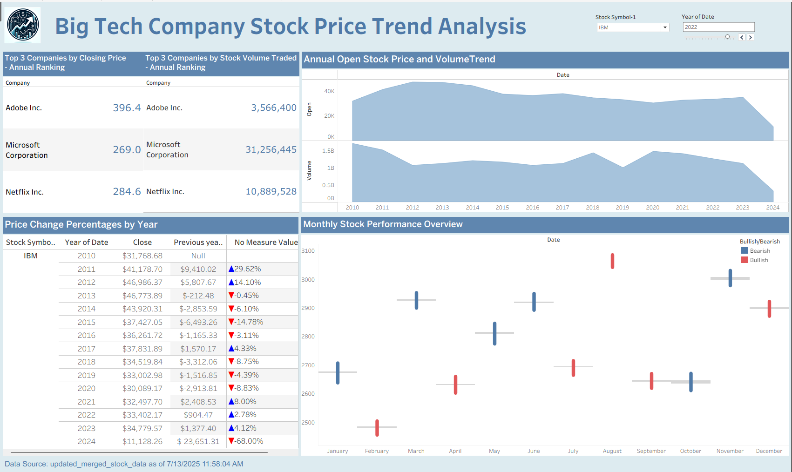

# 📊 Big Tech Company Stock Price Trend Analysis

This repository showcases a Tableau dashboard analyzing the stock price trends of major tech companies over time.

## 🔗 Live Dashboard

[Click here to view the dashboard on Tableau Public](https://public.tableau.com/app/profile/devraj.chauhan2111/viz/BigTechCompanyStockPriceTrendAnalysis/Dashboard1)

## 🖼️ Dashboard Preview

## 📌 Tools Used
- Tableau Public
- Yahoo Finance (data source)
- Time Series Analysis

## 📁 How to Use
1. Open the Tableau dashboard using the link above.
2. Interact with filters to explore trends by company and time.
3. View insights on performance comparisons, volatility, and overall trends.

---
